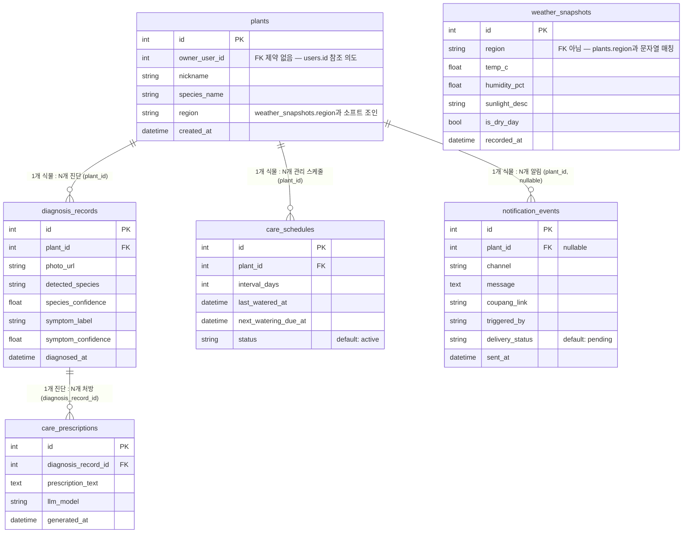

# Plant Manager ERD

`apps/plant` 관계형 스키마(PostgreSQL) ERD. ORM 정의(`apps/plant/adapter/outbound/orm/*.py`) 기준.

## 테이블 요약

| 테이블 | PK | FK (실제 제약) | 비고 |
|--------|----|--------|------|
| `plants` | `id` | — | `owner_user_id`는 FK 제약 없이 `apps/auth` 쪽 `users.id` 값을 참조하는 용도. `region`은 `weather_snapshots.region`과 문자열로만 연결(FK 아님) |
| `diagnosis_records` | `id` | `plant_id` → `plants.id` | 사진 기반 종·병징 진단 결과 (species/symptom confidence 포함) |
| `care_prescriptions` | `id` | `diagnosis_record_id` → `diagnosis_records.id` | 진단 결과 기반 LLM 처방 텍스트, `llm_model` 컬럼에 사용 모델명 기록 |
| `care_schedules` | `id` | `plant_id` → `plants.id` | 급수 등 관리 주기(`interval_days`) 및 다음 예정일 |
| `notification_events` | `id` | `plant_id` → `plants.id` (nullable) | 알림 발송 이력 — `coupang_link`로 커머스 연계, `delivery_status`로 발송 상태 추적 |
| `weather_snapshots` | `id` | — | 지역별 날씨 스냅샷. 다른 테이블과 FK로 연결되지 않고 `region` 문자열로만 매칭 |

## 참고

- ORM 소스: `apps/plant/adapter/outbound/orm/{plant,diagnosis_record,care_prescription,care_schedule,notification_event,weather_snapshot}_orm.py`
- 모든 PK는 `IntIdPrimaryKeyMixin` (`id`, autoincrement) 공통 사용
- 이 ERD는 **관계형(PostgreSQL) 스키마**만 다룬다. 외부 식물 데이터 API → Neo4j 지식그래프 적재 파이프라인(품종·생태 정보 그래프)은 별도 그래프 모델이며 이 문서 범위 밖.
